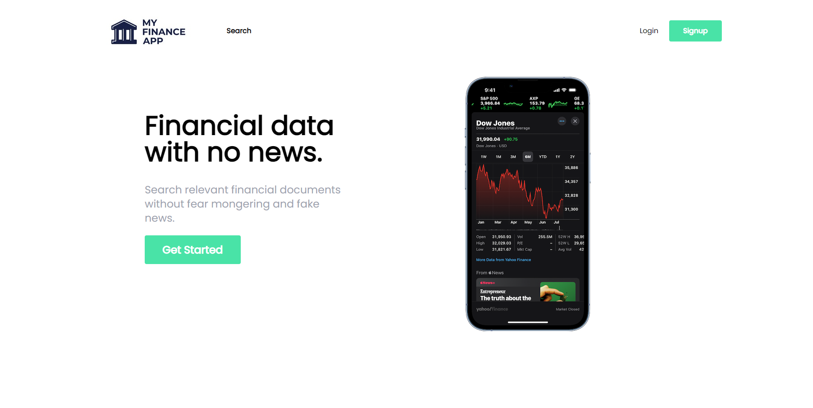

# My Finance App

[](./assets/images/homepage.png)

## Table of Contents

- [Overview](#overview)
- [Features](#features)
- [Technologies Used](#technologies-used)
- [Installation](#installation)
- [Usage](#usage)
- [Database Setup](#database-setup)
- [Contributing](#contributing)
- [License](#license)

## Overview

**My Finance App** is a powerful tool for managing and tracking your financial portfolios. The application allows users to keep track of their investments, view historical dividends, and visualize financial data with interactive charts.

## Features

- **Portfolio Management**: Add, edit, and delete financial assets in your portfolio.
- **Historical Dividend Tracking**: View historical dividend data for your assets.
- **Interactive Charts**: Visualize your portfolio's performance with easy-to-use charts.
- **User Authentication**: Secure login and registration system.
- **Responsive Design**: Accessible on both desktop and mobile devices.

## Technologies Used

- **Frontend**: React.js, TypeScript, Tailwind CSS
- **Backend**: Node.js, Express.js
- **Database**: SQL Server (Managed with SQL Server Management Studio)
- **Charting**: Recharts
- **Version Control**: Git and GitHub

## Installation

1. **Clone the repository**:

   ```bash
   git clone https://github.com/gamzeozgul/my-finance-app.git
   cd my-finance-app

2. **Install dependencies for the frontend:**:

   ```bash
   cd frontend
   npm install

3. **Set up the backend:**:

Ensure your SQL Server is running and accessible. Create a database named FinanceApp and configure the connection string in the backend.

4. **Install dependencies for the frontend:**:

   ```bash
   npm start
   
## Usage

- **Accessing the App:** Once the development server is running, open your browser and navigate to http://localhost:3000 to view the application.
- **Portfolio Management:** Use the app to add new assets, view your portfolio's performance, and analyze historical data.

## Database Setup

1. **SQL Server Configuration:**

- Open SQL Server Management Studio and create a new database named FinanceApp.
- Run the SQL scripts provided in the backend/sql folder to create necessary tables and seed data.

2. **Connection String:**

- Update the connection string in the backend configuration file to match your SQL Server setup.

